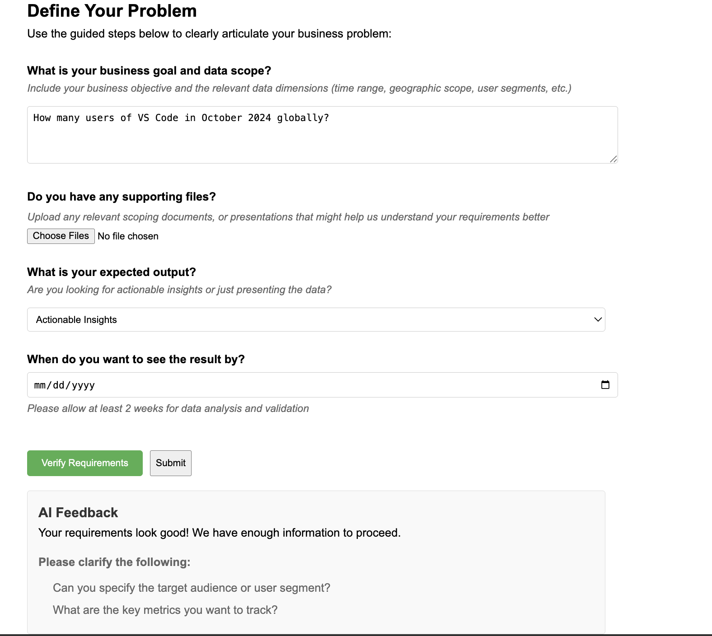

# Collaboration Platform for Product Managers and Data Scientists

Welcome to the Collaboration Platform for Product Managers and Data Scientists! This tool is designed to streamline communication and collaboration between product managers and data scientists, making requirement handovers seamless and enhancing project planning and data analysis efficiency.


## Platform Overview

This platform consists of two primary modules:

### 1. Requirement Submission Module for Product Managers


This module provides a structured interface for product managers to define project requirements and goals clearly.

- **Requirement Form**: Product managers can input detailed requirements, including goal descriptions, background information, priorities, timelines, etc.
- **Requirement Templates**: Standardized templates to help users efficiently fill out information and avoid missing key details.
- **Real-time Feedback**: An AI assistant analyzes input in real-time and provides suggestions to ensure clarity.

### 2. Planning and Analysis Module for Data Scientists

Once data scientists receive the requirements, they can use this module to plan and analyze projects.

- **Requirement Parsing**: With AI assistance, the system breaks down requirements into actionable tasks, helping data scientists quickly understand them.
- **Work Plan Generation**: Offers task prioritization, time allocation recommendations, and more.
- **Analysis Support**: Built-in data analysis tools and method recommendations enable data scientists to start exploratory analysis right away.
- **Feedback Mechanism**: Data scientists can provide feedback on requirements and suggest adjustments through the platform.

## Key Features

- **Efficient Communication**: Reduces repetitive communication caused by information gaps.
- **Intelligent Assistance**: AI provides optimization suggestions to help both parties reach a consensus faster.
- **Structured Data**: Unified formats for requirements and plans facilitate tracking and archiving.
- **Collaboration History**: Records every step from requirement submission to analysis completion for future review.

## How to Use

### Registration and Login

- Users need to register an account, provide basic information, and choose their role (Product Manager or Data Scientist).
- Log in to access the respective module.

### For Product Managers

- Go to the "Requirement Submission" page and fill out the required information as prompted.
- After submitting, track the progress of the requirement through the interface.

### For Data Scientists

- Access the "Requirement Reception" page to view the submitted requirements.
- Plan your tasks with AI assistance and choose tools to start your analysis.
- Submit analysis results or feedback on the requirements.

## Tech Stack

- **Frontend**: React.js, Tailwind CSS
- **Backend**: Node.js, Express
- **Database**: PostgreSQL
- **AI Support**: OpenAI GPT API
- **Deployment**: Docker, AWS

## Development and Contributions

We welcome community contributions!

1. Clone the repository:
   ```bash
   git clone <repository-url>
   ```
2. Install dependencies:
   ```bash
   npm install
   ```
3. Start the development environment:
   ```bash
   npm run dev
   ```
4. Submit a PR or raise an Issue to discuss improvement ideas.

## Contact

If you have any questions or suggestions, feel free to reach out:

- **Email**: [joycegu0919@gmail.com](mailto:support@example.com)

Thank you for using our platform! We hope it helps you work more efficiently.

